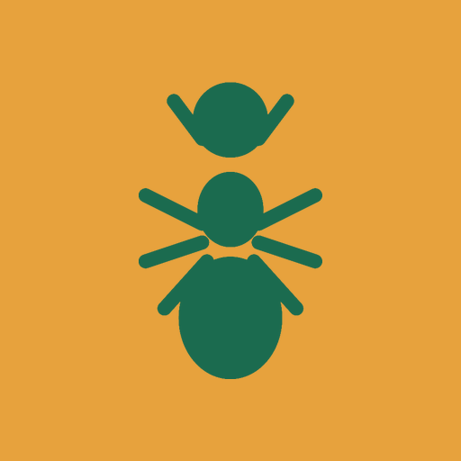
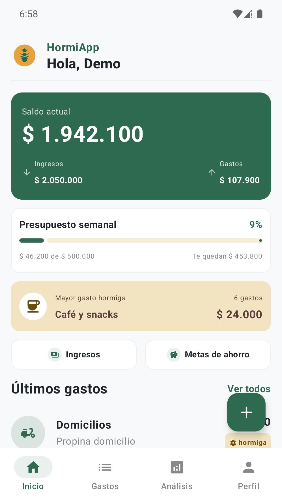
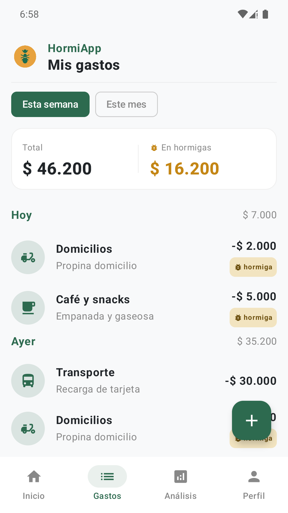
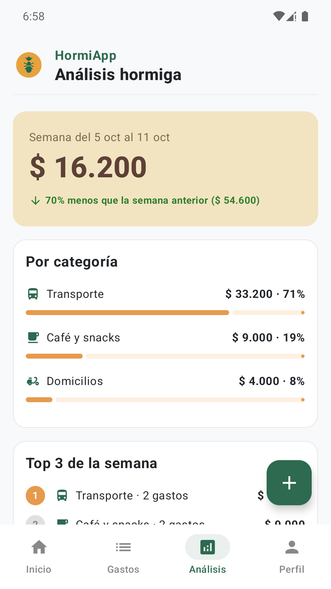
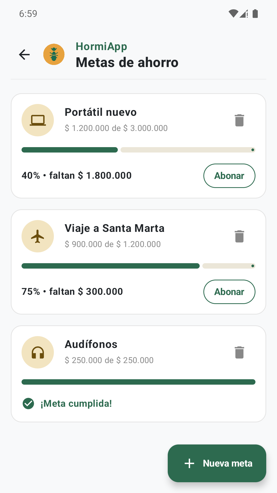

<p align="center">
  
</p>

<h1 align="center">HormiApp</h1>

<p align="center"><b>Cuida cada peso, hasta el más pequeño.</b></p>

HormiApp es una aplicación Android para controlar tus **finanzas personales** y descubrir tus **gastos hormiga**: esas compras pequeñas y frecuentes (un tinto, un snack, un pasaje, un domicilio) que casi no notas, pero que al final del mes suman mucho.

Funciona **sin internet** y **tus datos se quedan en tu celular**.

<p align="center">
  
  
  
  
</p>

## Qué puedes hacer

- **Registrar tus gastos** en segundos: monto, categoría, nota y fecha, con gastos rápidos para lo de todos los días. Puedes editarlos o eliminarlos.
- **Detectar tus gastos hormiga** automáticamente, según el límite que tú definas.
- **Ver tu presupuesto semanal**: cuánto llevas gastado y cuánto te queda.
- **Analizar tu semana**: cuánto gastaste en hormigas, cómo cambió frente a la semana anterior y en qué categorías se va tu dinero.
- **Descubrir el efecto a largo plazo**: cuánto gastarías al mes y al año si sigues a este ritmo, y cuánto podrías ahorrar.
- **Anotar tus ingresos**: tu ingreso mensual y los ingresos extra que te lleguen.
- **Crear metas de ahorro** y abonar a ellas hasta cumplirlas.
- **Personalizar la app**: moneda, tema claro u oscuro y un recordatorio diario para no olvidar registrar tus gastos.

## Tu cuenta y tu privacidad

- **Varias cuentas en el mismo celular.** Cada persona entra con su nombre y un PIN de 4 dígitos, y tiene sus propios gastos, metas y ajustes, separados de los demás.
- **Recuperar el PIN** es posible con la respuesta a tu pregunta de seguridad.
- **Todo se guarda solo en tu dispositivo.** La app no tiene acceso a internet, no tiene anuncios ni analítica, y no envía información a ningún servidor.
- **Puedes borrar tus datos** cuando quieras desde Perfil → Configuración.
- Lee la [política de privacidad completa](PRIVACY.md).

## Pruébala sin usar tus datos

En la pantalla de **Crear cuenta** toca **«Probar con usuario demo»**. Se crea una cuenta de ejemplo (nombre `Demo`, PIN `1234`) con gastos, ingresos y metas ya cargados, para que explores todas las pantallas. Puedes salir de ella y crear tu cuenta real cuando quieras: las demás cuentas del celular no se tocan.

## Requisitos

Android 8.0 (API 26) o superior.

## Diseño

El diseño de las pantallas está en la carpeta [`docs/`](docs/HormiApp%20-%20Dise%C3%B1o%20figma): alta fidelidad, variantes de cada pantalla y el wireframe manual digitalizado.

## El equipo

| Integrante | Rol |
|---|---|
| Sebastián Cruz | Diseño: boceto y wireframe en Figma |
| Sebastián Muñoz | Desarrollo Android |
| Juan David Londoño | Desarrollo Android |

Proyecto del curso de Aplicaciones Móviles. Hecho en Medellín, Colombia.

## Para desarrolladores

Hecha con **Kotlin y Jetpack Compose** (Material 3), arquitectura MVVM por capas (`ui` → `domain` → `data`), **Room** y **DataStore** para guardar los datos, **Hilt** para la inyección de dependencias y **Navigation Compose**. Configuración: `minSdk 26`, `targetSdk 37`.

Para ejecutarla, abre el proyecto en Android Studio y ejecútalo en un emulador o dispositivo, o desde la terminal:

```bash
./gradlew assembleDebug
```
